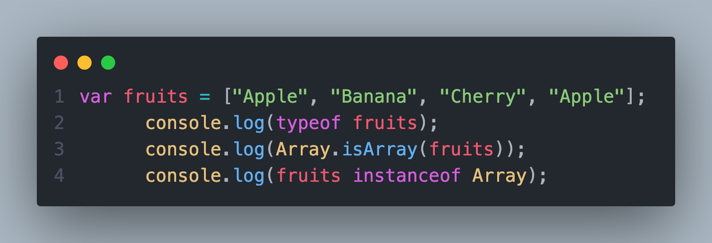
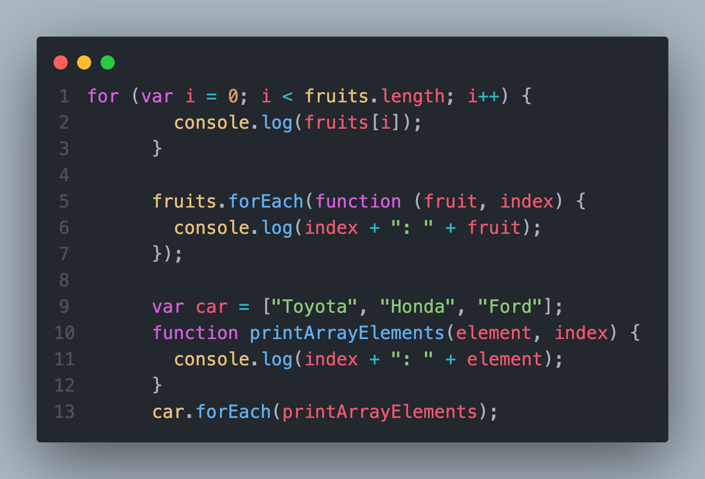
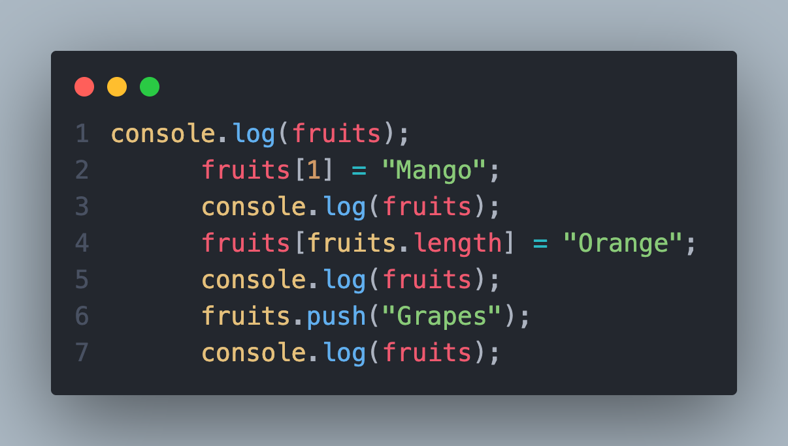
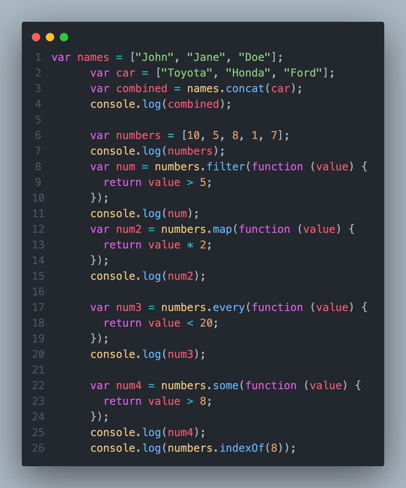
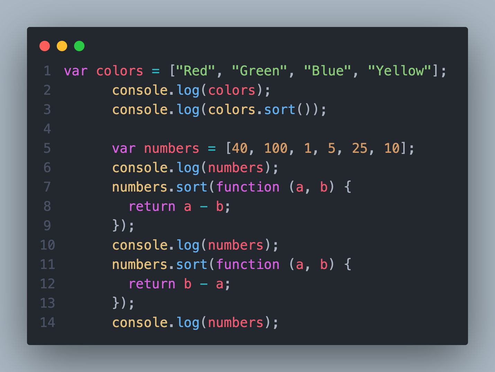
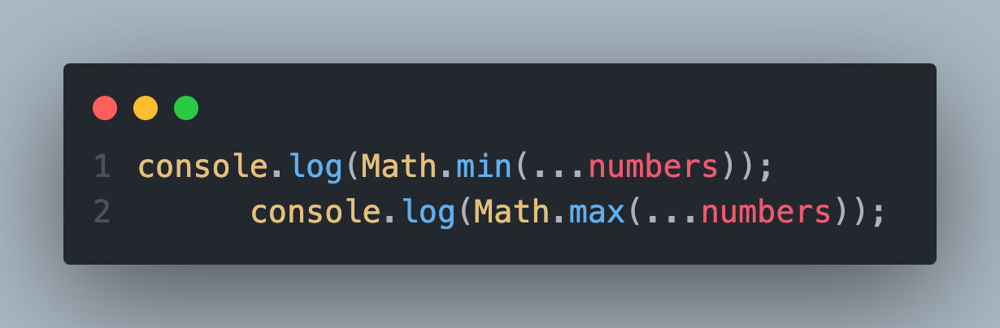

## **📅 تاریخ: 26 آبان 1404**

---
### ✨ کارهای انجام‌شده:
- ارایه ها در جاوااسکریپت
### 📈 یادداشت‌ها:
- ## Array:
    - #### تشخیص آرایه:[Go to Code](#code-1)
        - `Array.isArray();` --> True / False
        - `.... instanceof Array;` --> True / False
    - ### حلقه روی آیتم های آرایه:[Go to Code](#code-2)
        - `for + length`
        - `Array.forEach()`
    - ### اضافه کردن آیتم جدید:[Go to Code](#code-3)
        - `.push();`
        - `array[array.length] = "";`
    
    - ### توابع پر کاربرد:[Go to Code](#code-4)
        1. `.toString()`
        2. `.join()`
        3. `pop()`
        4. `concat()`
        5. `.filter()`
        6. `.map()`
        7. `.every()`
        8. `some()`
        9. `indexof()`
    - ### مرتب کردن آرایه:[Go to Code](#code-5)
        - `sort()`
        - `points.sort(function (a,b){return a-b / b-a})`
    - ### کوچکترین و بزرگترین:[Go to Code](#code-6)
        - ‍‍`Math.max`
        - `Math.min`

---
## code-1

---
## code-1

---
## code-1

---
## code-1

---
## code-1

---
## code-1
