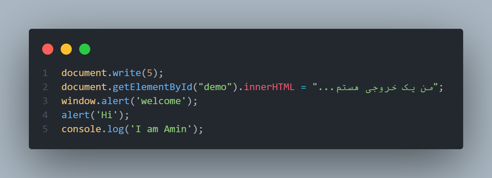

# 📝 Work Report
📅 تاریخ:11 آبان 1404

---
### ✨ کارهای انجام‌شده:
- چرا باید جاوااسکریپت را یاد بگیریم؟
- سکو های جاوا اسکریپت
- ساختار اصلی کدها در جاوا اسکریپت و نمایش خروجی

### 📈 یادداشت‌ها:
امروز سه قسمت از دوره را نگاه کردم و کد های زیر را نوشته و لجرا کردم:

- # .html

- # .js

