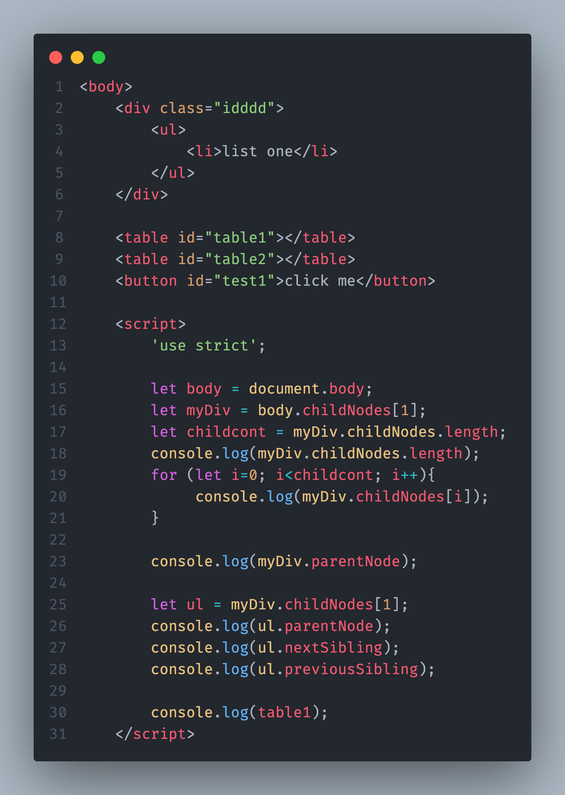

---
<h3 align="right"><b>فصل دوم 🔹</b></h3>
<h3 align="right"><b>قسمت: سوم 🎬</b></h3>
<h3 align="right"><b>۱۴۰۴/۰۹/۱۶ 📆</b></h3>

<h3 align="right"><b>"Dom navigation"</b></h3>

###### Home
> [توضیحات](#1) - [چیزهایی که یاد گرفتم](#2) - [سوالات و مشکلات](#3) - [کد ها و خروجی ها](#4)

---
###### 1
### 🔍 توضیحات
- DOM Navigation به مجموعه‌ای از روش‌ها گفته می‌شود که با استفاده از آن‌ها می‌توانیم داخل ساختار درختی صفحهٔ وب حرکت کنیم و به عناصر مختلف دسترسی داشته باشیم. در این کد با ویژگی‌هایی مثل childNodes برای رسیدن به فرزندان یک المنت، parentNode برای برگشتن به والد، و nextSibling / previousSibling برای جابه‌جایی بین گره‌های هم‌سطح کار می‌کنیم. این قابلیت‌ها کمک می‌کنند بفهمیم هر عنصر در چه جایگاهی از درخت DOM قرار دارد و چطور می‌توانیم آن را مدیریت، دستکاری یا از آن اطلاعات استخراج کنیم. این نوع پیمایش برای درک بهتر ساختار صفحه و نوشتن اسکریپت‌های دقیق و قابل‌اعتماد ضروری است.
> [Home](#home)
---
###### 2
## 🧠 چیزهایی که یاد گرفتم

- مفهوم DOM Navigation و اینکه ساختار صفحه مثل یه درخته
- دسترسی به فرزندان یک المنت با `childNodes`
- دسترسی به والد یک المنت با `parentNode`
- حرکت بین گره‌های هم‌سطح با `nextSibling` و `previousSibling`
- پیدا کردن تعداد فرزندان یک المنت
- گرفتن یک المنت خاص از بین فرزندان (مثل `childNodes[1]`)

### بخش مربوط به جدول‌ها (Table Navigation)
- دسترسی به ردیف‌های جدول با `table.rows`
- دسترسی به سلول‌های هر ردیف با `tr.cells`
- تشخیص شماره‌ی ردیف در کل جدول با `tr.rowIndex`
- تشخیص شماره‌ی ردیف داخل بخش خودش (مثلاً داخل `tbody`) با `tr.sectionRowIndex`
- دسترسی به قسمت‌های ساختاری جدول:
  - `table.caption`
  - `table.tHead`
  - `table.tFoot`
  - `table.tBodies`

> [Home](#home)

###### 3
## سوالات و مشکلات⁉️

> [Home](#home)
---
###### 4
## 🧪 تست‌ها و خروجی‌ها
- 
> [Home](#home)
