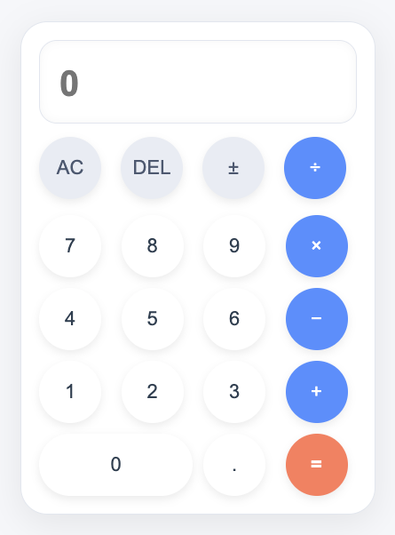

# 🧮 پروژه ساخت ماشین‌حساب تحت وب

## گزارش کار – HTML / CSS / JavaScript

---

## 📌 مقدمه

در این پروژه یک ماشین‌حساب ساده اما شیک و مدرن طراحی شده که شامل سه بخش اصلی است:

1. ساختار صفحه با **HTML**
2. طراحی و استایل‌دهی با **CSS (تم لایت و دکمه‌های گرد)**
3. پیاده‌سازی منطق محاسبات با **JavaScript**

---

## 🧱 بخش HTML

در ابتدا اسکلت اصلی ماشین‌حساب ساخته شد که شامل قسمت‌های زیر است:

- بخش نمایش (Display)
- دکمه‌های کنترل: `AC`, `DEL`, `±`, `/`
- دکمه‌های عددی از ۰ تا ۹
- دکمه عملگرها: `+ - * /`
- دکمه اعشار
- دکمه مساوی (`=`)

---

## 🎨 بخش CSS (تم لایت + دکمه‌های کاملاً گرد)

در این مرحله ظاهر ماشین‌حساب به صورت کامل طراحی شد. ویژگی‌های مهم استایل:

- **پس‌زمینه روشن (Light Mode)**
- **دکمه‌های سفید و کاملاً گرد (border-radius: 50%)**
- استفاده از رنگ‌های آبی و نارنجی برای دکمه‌های عملگر و مساوی  
  هدف این مرحله ایجاد یک UI مدرن، ساده و کاملاً خوانا بوده است.

---

## 🧠 بخش JavaScript (پیاده‌سازی توسط خودم)

منطق ماشین‌حساب با JS نوشته شده که شامل موارد زیر است:

- مدیریت مقدار فعلی و مقدار قبلی
- پشتیبانی از اعمال ریاضی: جمع، تفریق، ضرب، تقسیم
- جلوگیری از ورود اعشار تکراری
- جلوگیری از زدن چند عملگر پشت‌سرهم
- نمایش نتیجه روی صفحه
- پاک کردن کامل (`AC`) و پاک کردن یک کاراکتر (`DEL`)
- تغییر علامت (`±`)
- مدیریت دکمه مساوی و نمایش خروجی نهایی

---

## 📷 نتیجه نهایی

    

