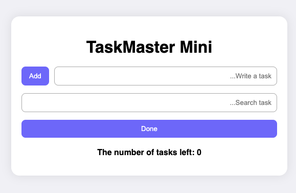

## 📝 General Overview of the TaskMaster Mini Page

This page is a simple task management application built with HTML for the structure and `main.js` for interactive behavior. Users can add new tasks, search through existing ones, and mark tasks as completed.

The task input field receives the text, and when the **Add** button is clicked, the corresponding JavaScript function creates a new item inside the `taskList`. The search section filters the tasks based on the typed text, and by clicking the **Done** button, the selected task is removed from the list.

JavaScript handles user interactions through `onchange` and `onclick` events, processes the input values, adds or removes task elements in the page, and updates the remaining task count displayed in the (`remaining`) section. This results in a lightweight and fast system for managing everyday tasks.

## 📝 توضیح کلی عملکرد صفحه TaskMaster Mini

این صفحه یک برنامه‌ی ساده برای مدیریت کارهاست که ساختار آن با HTML ساخته شده و رفتارهای تعاملی توسط فایل `main.js` کنترل می‌شود. کاربر می‌تواند یک تسک جدید وارد کند، آن را به لیست اضافه کند، بین تسک‌ها جستجو کند و آنها را انجام دهد.

ورودی افزودن کار، متن تسک را دریافت می‌کند و با کلیک روی دکمه‌ی Add تابع مربوط در جاوااسکریپت اجرا شده و یک آیتم جدید داخل لیست (`taskList`) ساخته می‌شود. بخش جستجو با هر بار تغییر متن، نام کاری را که وارد کرده اید با زدن دکمه Done کار را از لیست حذف می کند.

جاوااسکریپت با مدیریت رویدادهای `onchange` و `onclick` مقدار ورودی‌ها را پردازش کرده، عناصر مربوط به هر تسک را در صفحه اضافه یا حذف می‌کند و تعداد تسک‌های باقی‌مانده را در بخش شمارنده (`remaining`) به‌روزرسانی می‌کند. نتیجه‌ی این ساختار، یک سیستم سبک و سریع برای مدیریت وظایف روزمره است.
